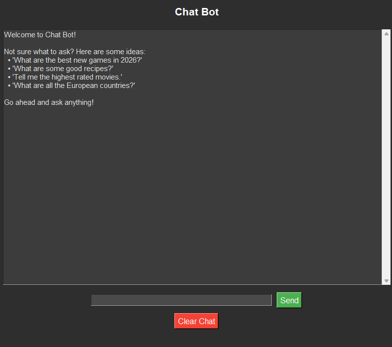

cat << 'EOF' > README.md
# Claude Chatbot (Tkinter) 🤖💬

A simple **desktop chatbot** built with Python, Tkinter, and the Anthropic Claude API.  
It provides a clean GUI with **real-time streaming responses** while keeping the interface responsive using multithreading.

---

## 📸 Screenshot

---

## 🛠 Features

- ⚡ Real-time streaming responses from Claude
- 🖥️ Clean and simple Tkinter GUI
- 🔄 Multi-threaded design (no UI freezing)
- 🔐 Secure API key via environment variables
- 🚀 Lightweight and easy to run

---

## 🚀 How to Run

### 1. Clone the repository

git clone https://github.com/your-username/claude-chatbot.git
cd claude-chatbot

### 2. Install dependencies

pip install anthropic

### 3. Set your API key

Windows (PowerShell):
setx ANTHROPIC_API_KEY "your_api_key_here"

Restart terminal after setting it.

Linux / macOS:
export ANTHROPIC_API_KEY="your_api_key_here"

---

## 📝 Usage

Run the app:

python ChatbotReadyAPIClaude.py

Then:
- Type your message in the input box
- Receive streaming responses from Claude in real time

---

## 📦 File Structure

claude-chatbot/
├── ChatbotReadyAPIClaude.py   # Main application
├── README.md                  # Project documentation
├── .gitignore                 # Ignored files
└── APIChatBot.png             # Screenshot

---

## ⚙️ How It Works

1. Tkinter creates the GUI window
2. User input is captured from the chat box
3. A background thread sends the request to Claude API
4. Streaming response is displayed incrementally in the UI
5. Main thread stays responsive throughout

---

## ⚡ Future Improvements

- Add chat history saving
- Improve UI styling (dark mode / themes)
- Support multiple Claude models
- Add markdown rendering in responses
- Export chat to file

---

## 💻 Technologies

- Python 3.x
- Tkinter
- Anthropic Claude API
- Threading

---

## 📧 Contact

Created by Mitsos – feel free to contribute or open issues!

EOF
